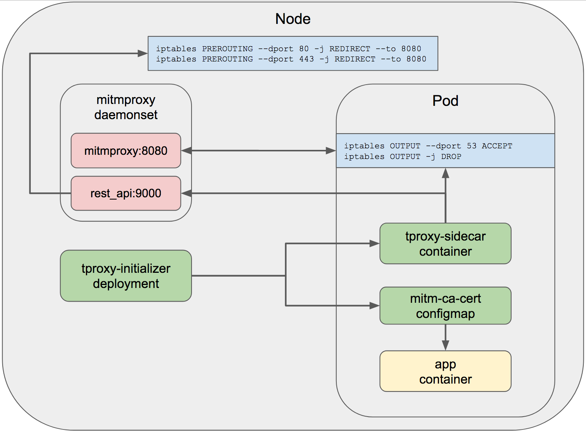

# Kubernetes Transparent Proxy Example

Example of how to deploy a transparent proxy to filter and intercept all http/s traffic out of a pod.

This is done using the [`tproxy-initializer`](./tproxy-initializer) Kubernetes Initializer to inject a sidecar init container, configmap and environment variables into a deployment when the annotation `"initializer.kubernetes.io/tproxy": "true"` is present. 

The purpose of the [`tproxy-sidecar`](./tproxy-sidecar) container is to create iptables rules in the pod network to block egress traffic out of the pod. The [`tproxy-podwatch`](./tproxy-podwatch) controller watches for pod changes containing the annotation and automatically add/removes the local firewall REDIRECT rules to apply the transparent proxy to the pod.

Technology used:

- [Kubernetes Initializers](https://kubernetes.io/docs/admin/extensible-admission-controllers/#what-are-initializers)
- [Kubernetes Controllers](https://github.com/kubernetes/community/blob/master/contributors/devel/controllers.md)
- [Kubernetes RBAC](https://kubernetes.io/docs/admin/authorization/rbac/)
- [mitmproxy](https://mitmproxy.org/)
- [Kubernetes Helm](https://github.com/kubernetes/helm)
- [Google Container Engine](https://cloud.google.com/container-engine/)

**Figure 1.** *tproxy diagram*



## Example

### Mitmproxy Script

This example uses the mitmproxy python script shown below to filter traffic to a specific GCS bucket. The script is installed via the [configmap resource](./mitmpoxy/templates/configmap-mitmproxy.yaml) and parameters are passed using Helm values.

```python
from mitmproxy import http
import re
import os

ALLOW_BUCKET_NAME = "{{ .Values.scripts.gcs_bucket_name }}"

RE_BUCKET = re.compile(r'https://storage.googleapis.com/%s/.*' % ALLOW_BUCKET_NAME)

def request(flow: http.HTTPFlow) -> None:
    if not RE_BUCKET.match(flow.request.pretty_url):
        flow.response = http.HTTPResponse.make(
            418,
            b"Access Denied by Administrator",
            {"Content-Type": "text/html"}
        )
```

Notice that the URL is HTTPS, clients accessing this resource will need to have the [mitmproxy CA cert installed](http://docs.mitmproxy.org/en/stable/certinstall.html) for the connection to be trusted. The `tproxy-initializer` injects this CA into the container filesystem at runtime so it's automatically available and trusted.

### Create alpha GKE cluster

As of K8S 1.7 the initializers feature is alpha and requires an alpha GKE cluster.

Create cluster with latest Kubernetes version and alpha features enabled:

```sh
VERSION=$(gcloud container get-server-config --format='get(validMasterVersions[0])')

gcloud container clusters create dev \
  --machine-type n1-standard-4 \
  --num-nodes 3 \
  --enable-kubernetes-alpha \
  --cluster-version $VERSION \
  --no-enable-legacy-authorization
```

### Generate mitmproxy Certificates
Before installing the chart, you must first get the certificates generated by mitmproxy. The generated CA cert will be used in the target pods to trust the proxy when making HTTPS requests.

```sh
docker run --rm -v ${PWD}/mitmproxy/certs/:/home/mitmproxy/.mitmproxy mitmproxy/mitmproxy >/dev/null 2>&1
```

### Install Helm and Deploy Chart

Install the Helm tool locally per the docs at the link below.

https://github.com/kubernetes/helm/blob/master/docs/install.md

Create service account for Helm:

```sh
kubectl create serviceaccount --namespace kube-system tiller
kubectl create clusterrolebinding tiller-cluster-rule --clusterrole=cluster-admin --serviceaccount=kube-system:tiller
```

Initialize Helm:

```sh
helm init --service-account=tiller --upgrade
```

Install the Helm chart:

```sh
helm install -n tproxy mitmproxy
```

### Deploy sample apps

Run the sample apps to demonstrate using and not using the annotation to trigger the initializer. There are variants for Debian and CentOS to show how the mitmproxy ca certs are mounted per distro.

```
kubectl create -f example-app/deployment-debian.yaml
kubectl create -f example-app/deployment-debian-locked.yaml
```

Here is the YAML for the deployment with the annotation:

```yaml
apiVersion: extensions/v1beta1
kind: Deployment
metadata:
  name: debian-app-locked
  annotations:
    "initializer.kubernetes.io/tproxy": "true"
spec:
  replicas: 1
  selector:
    matchLabels:
      app: debian-app
  template:
    metadata:
      labels:
        app: debian-app
        variant: locked
    spec:
      containers:
        - name: app
          image: danisla/example-app:debian
```

### Test output

Pod without tproxy:

```sh
kubectl logs $(kubectl get pods --selector=app=debian-app,variant=unlocked -o=jsonpath={.items..metadata.name})
```

```
https://www.google.com: 200
https://storage.googleapis.com/solutions-public-assets/: 200
PING www.google.com (209.85.200.105): 56 data bytes
64 bytes from 209.85.200.105: icmp_seq=0 ttl=52 time=0.758 ms
```

Notice that traffic to https endpoints is unrestricted and returning status code 200. The ping also succeeds.

Pod with tproxy:

```sh
kubectl logs $(kubectl get pods --selector=app=debian-app,variant=locked -o=jsonpath={.items..metadata.name})
```

```
https://www.google.com: 418
https://storage.googleapis.com/solutions-public-assets/: 200
PING www.google.com (209.85.200.147): 56 data bytes
ping: sending packet: Operation not permitted
```

Notice that all http/s traffic is proxied through mitmproxy, only the route to the google storage bucket is permitted per the mitmproxy python script. All other egress traffic is rejected.

Inspecting the logs from the mitmproxy pod show the intercepted requests and responses. To get the logs, first identify which node the pod is running on, then get logs for the tproxy instance on that node.

```sh
kubectl logs $(kubectl get pods -o wide | awk '/mitmproxy.*'$(kubectl get pods --selector=app=debian-app,variant=locked -o=jsonpath={.items..spec.nodeName})'/ {print $1}') -c mitmproxy-tproxy-mode
```

```
10.12.1.41:37380: clientconnect
10.12.1.41:37380: GET https://www.google.com/ HTTP/2.0
               << 418 I'm a teapot 30b
10.12.1.41:37380: clientdisconnect
10.12.1.41:36496: clientconnect
Streaming response from 64.233.191.128
10.12.1.41:36496: GET https://storage.googleapis.com/solutions-public-assets/adtech/dfp_networkimpressions.py HTTP/2.0
               << 200  (content missing)
10.12.1.41:36496: clientdisconnect
```

### Cleanup

Delete the sample apps:

```sh
kubectl delete -f exmaple-apps/
```

Delete the tproxy helm release:

```sh
helm delete --purge tproxy
```

Delete the GKE cluster:

```sh
gcloud container clusters delete dev
```

# Building the Images

Use [Container Builder](https://cloud.google.com/container-builder/docs/) to build the container images. This will place the images in your current project.

```sh
cd tproxy-initializer && ./build-container && cd -

cd tproxy-podwatch && ./build-container && cd -

cd tproxy-sidecar && ./build-container && cd -
```

You can use your custom images when installing the chart by setting the `images.tproxy_registry` value.

```sh
PROJECT_ID=$(gcloud config get-value project)

helm install -n tproxy --set images.tproxy_registry=${PROJECT_ID} mitmproxy
```